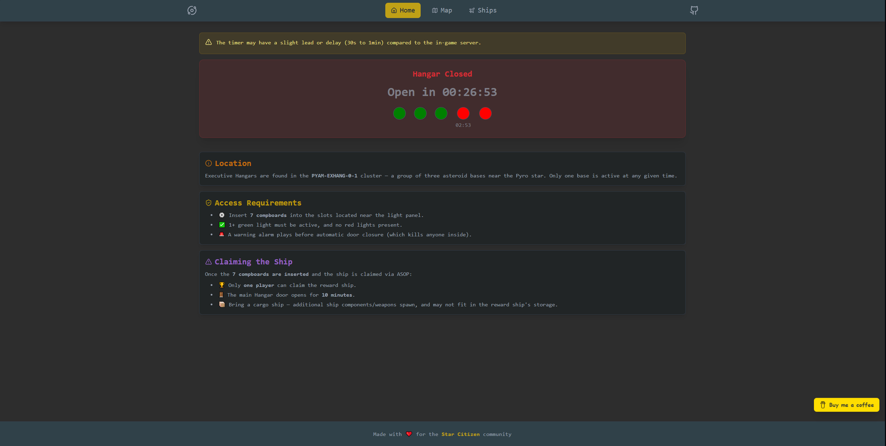

<h3 align="center">
  <samp>&gt; Star Citizen - Executive Hangar</samp>
</h3>

   
  
   
  An interactive web app that lets you understand and visualise how the <a href="https://sc-exechang.vercel.app">Executive Hangar works in Star Citizen</a>
   

## 🚀 Usage

> [!WARNING]  
> The timer may have a slight lead or delay (30s to 1min) compared to the in-game server.  

## 🛠️ Technical stack

| Stack | Notes |
| - | - |
| Frontend | `React` + `Vite` + `TailwindCSS` + `Typescript` |
| Data | `environment variable` |
| Visualisation | Interactive components |

## 📄 License

This project is licensed under the [MIT License](./LICENSE).
